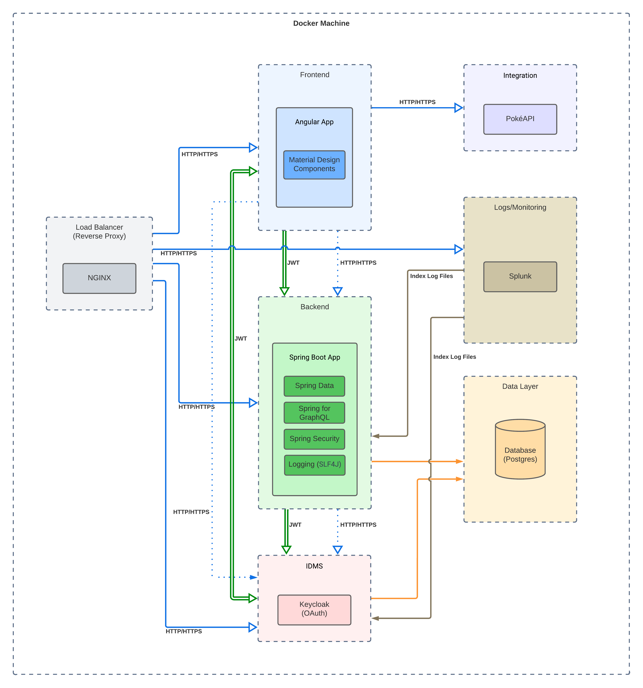

# poke-station
This project is an challenge implementation for a Pokemon Trainer Index.

# Solution Architecture Diagram

This diagram represents the architecture of the solution. Including main components, interactions between modules, and integrations with external systems.

# Solution Architecture Description

This section describes the main components of the solution architecture and their interactions.

## Load Balancer (Reverse Proxy)

> NGINX 

NGINX acts as an efficient web server, reverse proxy, and load balancer, providing a robust solution for optimizing network traffic in web environments. In the role of a reverse proxy, NGINX directs client requests to application servers, hiding the complexity of the underlying infrastructure. This approach increases security and improves performance by enabling horizontal scalability without directly exposing application servers. Additionally, as a load balancer, NGINX distributes requests among application servers in a balanced manner, promoting efficiency and high availability. Its lightweight design, modularity, and ability to handle thousands of simultaneous connections make NGINX a popular choice for improving the reliability and efficiency of web applications.

> Services

| Context      | Description                                 |
| ------------ | ------------------------------------------- |
| /            | Root context redirects to the frontend app  |
| /backend     | Redirects to the backend spring boot app    |
| /auth        | Redirects to Keycloak server                |
| /splunk      | Redirects to Splunk server                  |

## Frontend

> Angular App

This component represents the user interface, where the index of trainers and their pokemons is presented.
Using Angular on the frontend offers a robust and efficient framework for developing modern web applications. As a JavaScript framework maintained by Google, Angular offers a modular, componentized architecture that makes it easier to organize and maintain source code. Additionally, Angular offers a powerful library of ready-to-use components, supports dependency injection, and makes it easy to manipulate application state. Its declarative approach to building user interfaces, along with features like routing and form management, makes Angular a robust choice for agile, scalable, and sustainable frontend application development.

> Material Design Components

The choice of Material Design is justified by its cohesive and visually attractive approach, providing a consistent and intuitive user experience across multiple platforms. Furthermore, the wide availability of pre-developed components facilitates the efficient and elegant implementation of interfaces, contributing to the design effectiveness and visual standardization of the application.

## Backend

The backend component is built on the Spring Boot framework, making use of Spring Data to simplify data access and manipulation operations in the relational database, ensuring efficiency and productivity in development. Choosing Spring GraphQL provides a flexible, type-driven query layer, enabling clients to request specific data efficiently, reducing data transmission overhead. Spring Security integration ensures resource protection, implementing authentication and authorization in a scalable and configurable way. Using SLF4J as a logging framework provides a logging abstraction that is compatible with multiple implementations, providing flexibility in configuring and managing logs, essential for monitoring and troubleshooting in production environments. These choices aim to promote a robust, secure and efficient backend, maintaining the flexibility necessary for the system's evolution.

